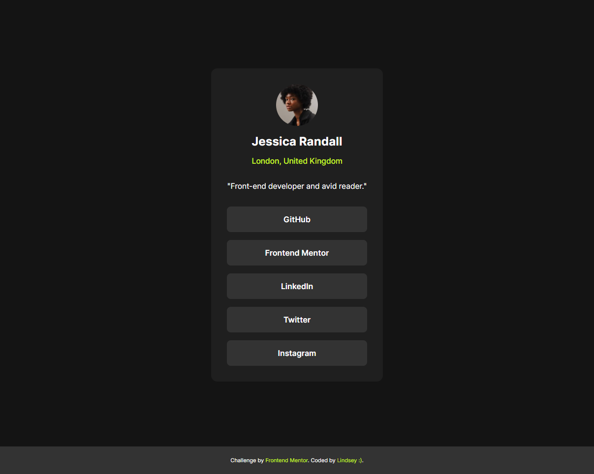

# Frontend Mentor - Social links profile solution

This is a solution to the [Social links profile challenge on Frontend Mentor](https://www.frontendmentor.io/challenges/social-links-profile-UG32l9m6dQ). Frontend Mentor challenges help you improve your coding skills by building realistic projects. 

## Table of contents

- [Overview](#overview)
  - [The challenge](#the-challenge)
  - [Screenshot](#screenshot)
  - [Links](#links)
- [My process](#my-process)
  - [Built with](#built-with)
  - [What I learned](#what-i-learned)

## Overview

### The challenge

Users should be able to:

- See hover and focus states for all interactive elements on the page

### Screenshot

### Links

- Solution URL: [Add solution URL here](https://your-solution-url.com)
- Live Site URL: [Add live site URL here](https://your-live-site-url.com)

## My process

### Built with

- Semantic HTML5 markup
- CSS custom properties

### Useful resources

- [World Wide Web Consortium (W3C)](https://www.w3.org/WAI/WCAG21/Understanding/) - Helpful resource for understanding, and learning more about accessibility requirements. 

### What I learned

First Frontend Mentor after a long time away! For this challenge, I focused on adding animations for more interaction and include accessibility to improve on making sure it passes WCAG.

## Author

- Frontend Mentor - [@LindseyGunderson](https://www.frontendmentor.io/profile/LindseyGunderson)
